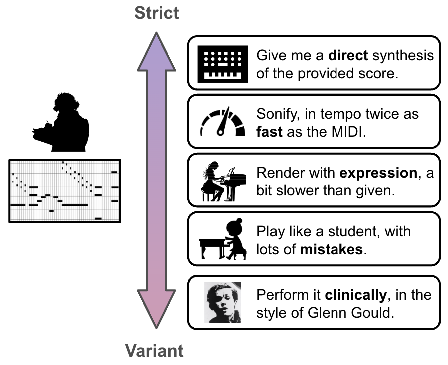
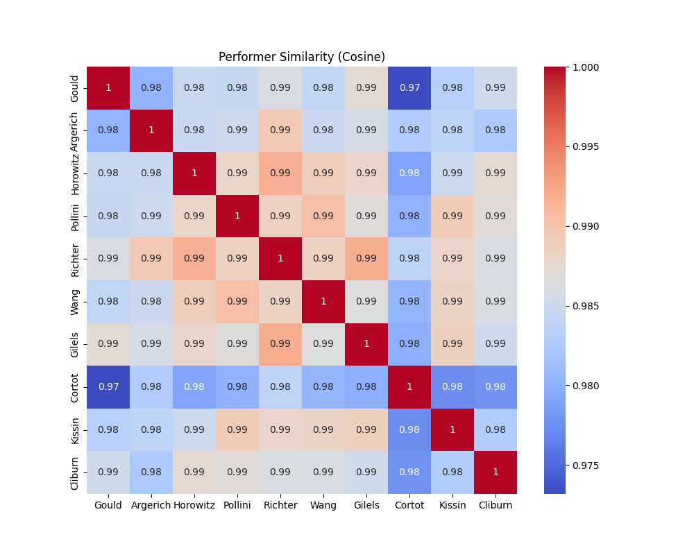
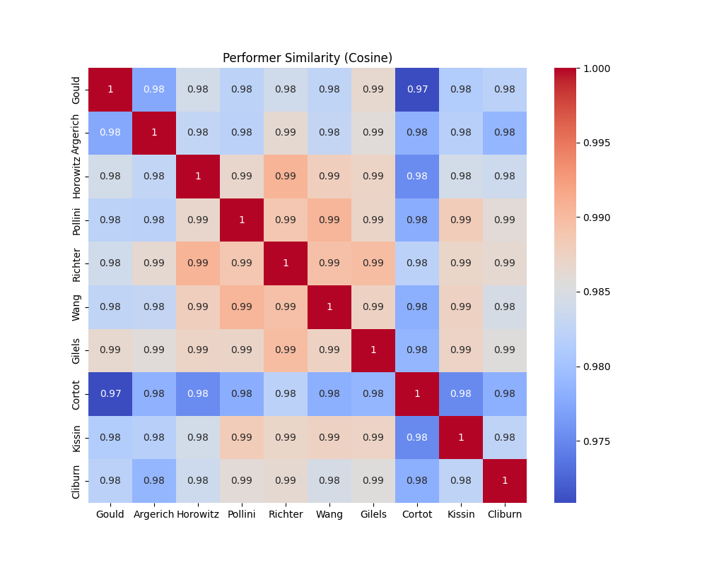
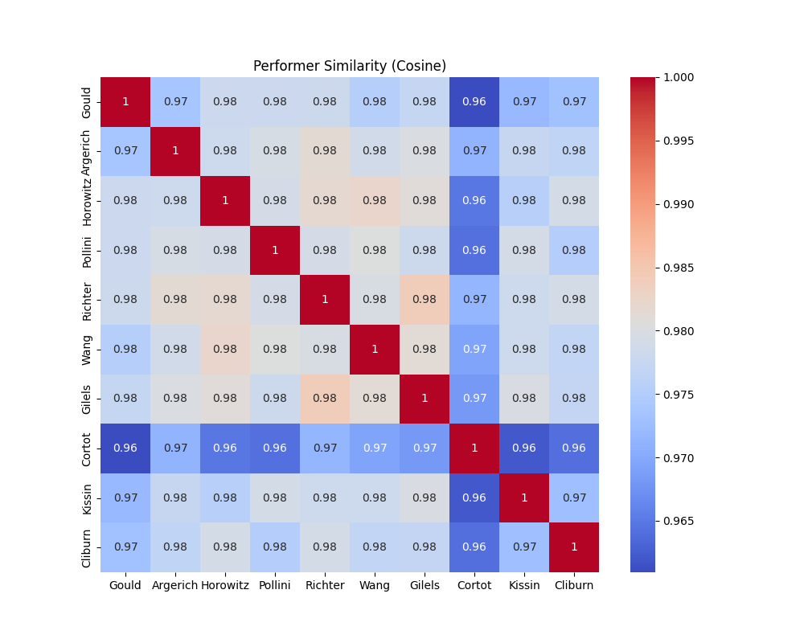
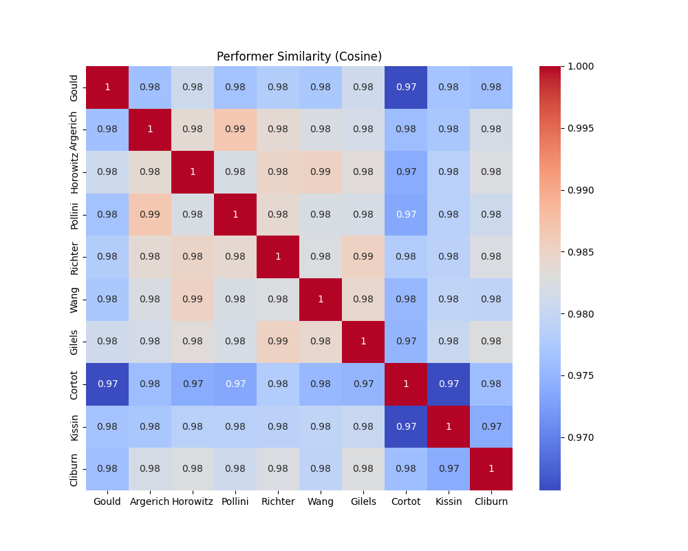
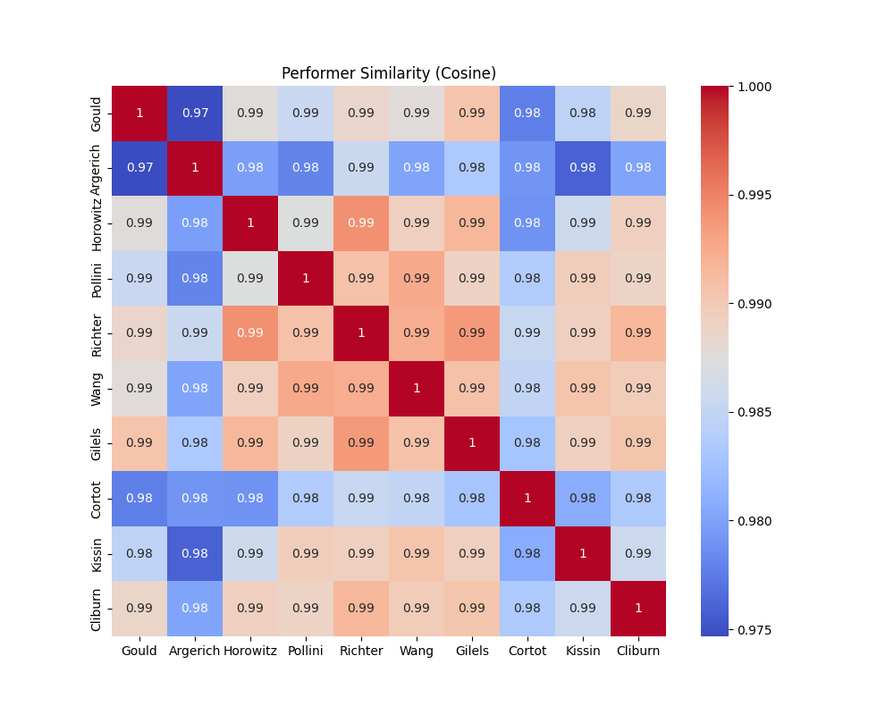
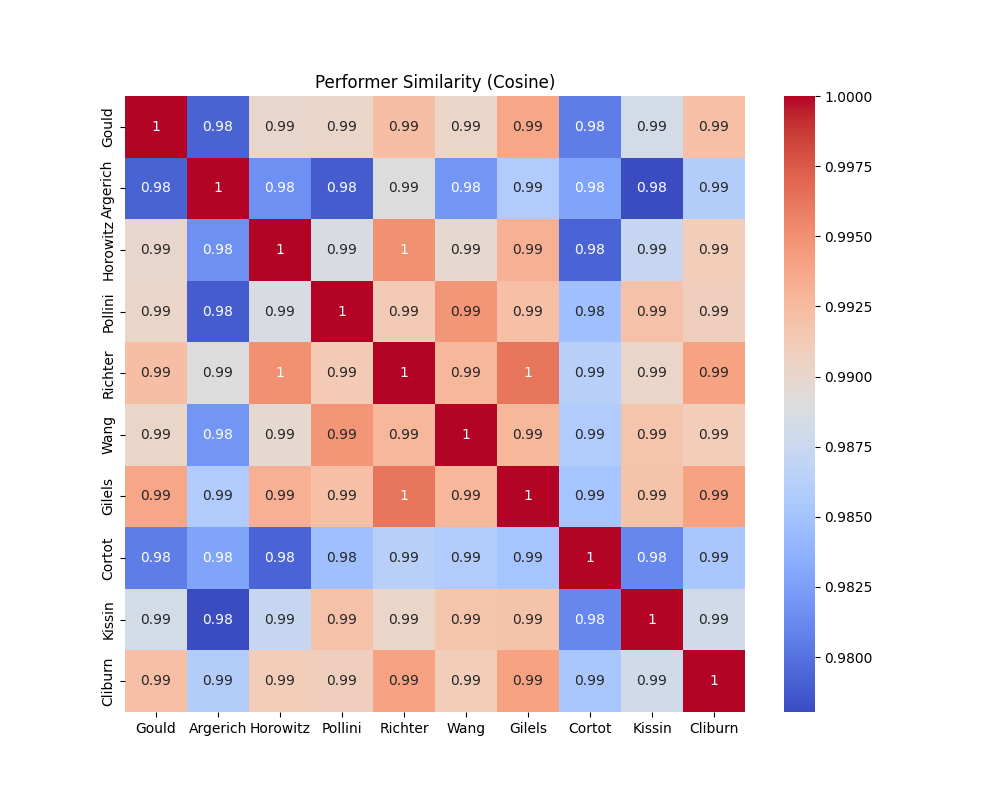
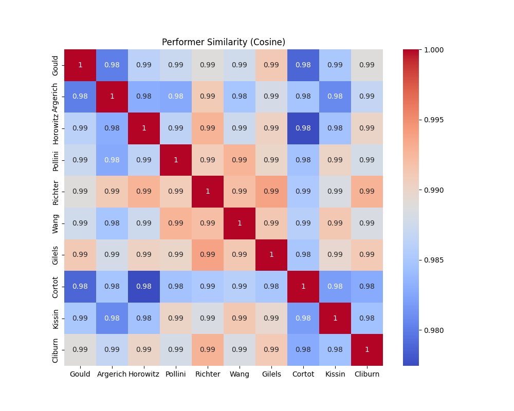
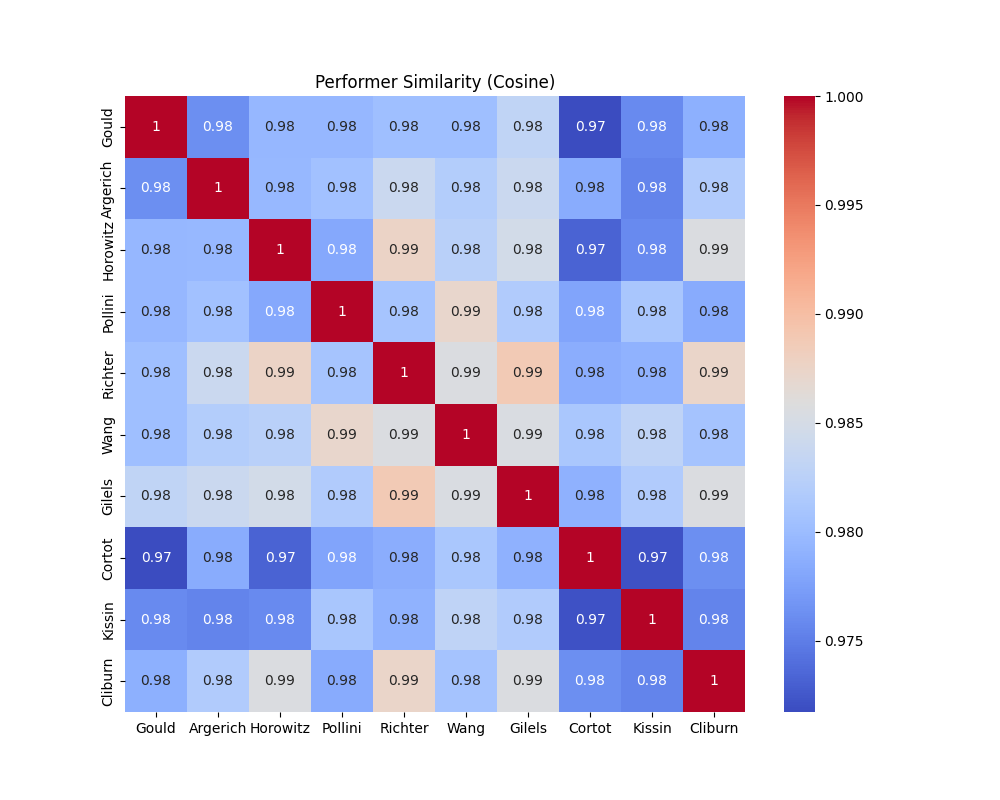
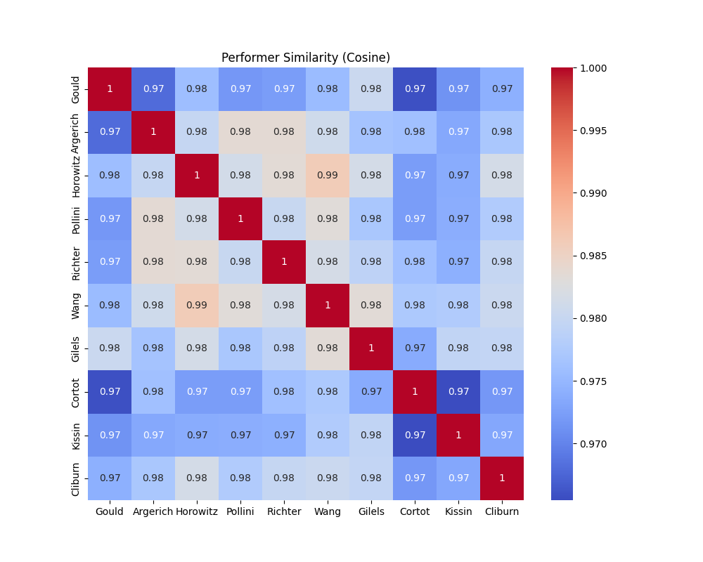

<!-- 

  
Huan Zhang1, Akira Maezawa2, Simon Dixon1

  

    1Centre for Digital Music, Queen Mary University of London 
    2Yamaha Corporation
  

 -->

## Introduction 🎶

Welcome to the official page for **RenderBox: Expressive Performance Rendering with Text Control**. This project presents a unified framework for generating expressive music performances from symbolic scores and text descriptions. With applications across multiple instruments, RenderBox introduces a diffusion transformer-based architecture combined with natural language prompts and MIDI scores for both coarse and granular control.

Our curriculum-based paradigm spans a wide spectrum of tasks, from plain synthesis to expressive rendering, offering control over factors like speed, mistakes, and style diversity. This approach bridges symbolic scores and natural language, making performance rendering more explainable and accessible.

<!-- For more details, refer to the manuscript: -->
<!-- [RenderBox: Expressive Performance Rendering with Text Control (PDF)](https://example-link-to-your-manuscript.pdf). -->

<!-- figure on paper -->

  
  <!-- 
<em>Overview of the RenderBox performance space</em>
 -->

---

##  Outputs 🎵

### **Synthesis**
<table>
  <tr>
    <th style="width: 30%;">Input Score MIDI</th>
    <th style="width: 20%;">Text Prompt 1</th>
    <th style="width: 30%;">Output 1</th>

  </tr>
  
  <tr>
    <td><audio controls><source src="static/upper/synth/17/synthmid.wav" type="audio/wav"></audio> 
    <em>Bach BWV 876 Prelude</em></td>
    <td>Synthesis</td>
    <td><audio controls><source src="static/upper/synth/17/output.wav" type="audio/wav"></audio></td>
  </tr>
  <tr>
    <td><audio controls><source src="static/upper/synth/107/synthmid.wav" type="audio/wav"></audio> 
    <em>Valse - Manuel Ponce </em></td>
    <td>Synthesis</td>
    <td><audio controls><source src="static/upper/synth/107/output.wav" type="audio/wav"></audio></td>
  </tr>
  <tr>
    <td><audio controls><source src="static/upper/synth/bach02/midi_synthesized.wav" type="audio/wav"></audio> 
    <em>Bach BWV Violin Sonata 1002 Mvt.1</em></td>
    <td>Synthesis</td>
    <td><audio controls><source src="static/upper/synth/bach02/output.wav" type="audio/wav"></audio></td>
  </tr>
</table>

### **Synthesis with Speed Augmentation**
<table>
  <tr>
    <th style="width: 24%;">Input Score MIDI</th>
    <th style="width: 14%;">Text Prompt 1</th>
    <th style="width: 24%;">Output 1</th>
    <th style="width: 14%;">Text Prompt 2</th>
    <th style="width: 24%;">Output 2</th>
  </tr>
  <tr>
      <td><audio controls><source src="static/upper/synth_speed/1/a_bit_faster/gt_synthmid.wav" type="audio/wav"></audio> 
      <em>Haydn, Op.64 No.1</em></td>
      <td>Direct synthesis, a bit faster</td>
      <td><audio controls><source src="static/upper/synth_speed/1/a_bit_faster/output.wav" type="audio/wav"></audio></td>
      <td>slightly slower, synthesis</td>
      <td><audio controls><source src="static/upper/synth_speed/1/a_bit_slower/output.wav" type="audio/wav"></audio></td>
  </tr>
  <tr>
      <td><audio controls><source src="static/upper/synth_speed/2/a_bit_faster/gt_synthmid.wav" type="audio/wav"></audio> 
      <em>Légende - Ernest Shand</em></td>
      <td>A bit faster than score, direct synthesis</td>
      <td><audio controls><source src="static/upper/synth_speed/2/a_bit_faster/output.wav" type="audio/wav"></audio></td>
      <td>Synthesis, much faster</td>
      <td><audio controls><source src="static/upper/synth_speed/2/much_faster/output.wav" type="audio/wav"></audio></td>
  </tr>
  <tr>
      <td><audio controls><source src="static/upper/synth_speed/3/a_bit_faster/gt_synthmid.wav" type="audio/wav"></audio> 
      <em>Ravel, Miroirs, Une Barque</em></td>
      <td>Direct synthesis, a bit faster</td>
      <td><audio controls><source src="static/upper/synth_speed/3/a_bit_faster/output.wav" type="audio/wav"></audio></td>
      <td>Synthesis, a bit slower</td>
      <td><audio controls><source src="static/upper/synth_speed/3/a_bit_slower/output.wav" type="audio/wav"></audio></td>
  </tr>

  <!-- Add 4 more rows here -->
</table>

### **Expressive Performance**
<table>
  <tr>
    <th style="width: 24%;">Input Score MIDI</th>
    <th style="width: 14%;">Text Prompt 1</th>
    <th style="width: 24%;">Output 1</th>
    <th style="width: 14%;">Text Prompt 2</th>
    <th style="width: 24%;">Output 2</th>
  </tr>
  <tr>
    <td><audio controls><source src="static/upper/perf/5/synthmid.wav" type="audio/wav"></audio> 
    <em>Chopin Piano Etude Op.25 No.12</em></td>
    <td>faithfully matching tempo, Chopin, Etudes_op_25, 12, expressive performance</td>
    <td><audio controls><source src="static/upper/perf/5/output.wav" type="audio/wav"></audio></td>
    <td>considerably slower, expressive performance, Chopin</td>
    <td><audio controls><source src="static/upper/perf/5/output2.wav" type="audio/wav"></audio></td>
  </tr>
  <tr>
    <td><audio controls><source src="static/upper/perf/477/synthmid.wav" type="audio/wav"></audio> 
    <em>Malagueña de Isaac Albéniz</em></td>
    <td>Guitar, Expressive performance, in line with the score's tempo</td>
    <td><audio controls><source src="static/upper/perf/477/output.wav" type="audio/wav"></audio></td>
    <td>guitar expressive performance, a bit faster than score</td>
    <td><audio controls><source src="static/upper/perf/477/output2.wav" type="audio/wav"></audio></td>
  </tr>
  <tr>
    <td><audio controls><source src="static/upper/perf/17/synthmid.wav" type="audio/wav"></audio> 
    <em>Beethoven Piano Sonata No.16 Mvt.1</em></td>
    <td>Beethoven, faithfully matching, Piano, expressive performance</td>
    <td><audio controls><source src="static/upper/perf/17/output.wav" type="audio/wav"></audio></td>
    <td>expressive, a bit faster</td>
    <td><audio controls><source src="static/upper/perf/17/output2.wav" type="audio/wav"></audio></td>
  </tr>
  <tr>
    <td><audio controls><source src="static/upper/perf/316/synthmid.wav" type="audio/wav"></audio> 
    <em>Sidewinder (Sax funk)</em></td>
    <td>at the same tempo, Expressive playings</td>
    <td><audio controls><source src="static/upper/perf/316/output.wav" type="audio/wav"></audio></td>
    <td>Saxophone, no expression, at the same tempo</td>
    <td><audio controls><source src="static/upper/perf/316/output2.wav" type="audio/wav"></audio></td>
  </tr>
  <tr>
    <td><audio controls><source src="static/upper/perf/263/synthmid.wav" type="audio/wav"></audio> 
    <em>Bach Violin Sonata BWV1003, Mvt.2</em></td>
    <td>bwv1003, just under the score’s tempo, Expressive performance</td>
    <td><audio controls><source src="static/upper/perf/263/output.wav" type="audio/wav"></audio></td>
    <td>Violin, expressive performance,  faster than score</td>
    <td><audio controls><source src="static/upper/perf/263/output2.wav" type="audio/wav"></audio></td>
  </tr>
  <tr>
    <td><audio controls><source src="static/upper/perf/181/synthmid.wav" type="audio/wav"></audio> 
    <em>Haydn String Quartet No 53 in D major</em></td>
    <td>Expressive performance, at the original speed</td>
    <td><audio controls><source src="static/upper/perf/181/output.wav" type="audio/wav"></audio></td>
    <td>String Quartet, Expressive performance, much slower, Haydn</td>
    <td><audio controls><source src="static/upper/perf/181/output2.wav" type="audio/wav"></audio></td>
  </tr>
  <tr>
    <td><audio controls><source src="static/upper/perf/352/synthmid.wav" type="audio/wav"></audio> 
    <em>David Russell: Rondeña - Regino Sainz de la Maza</em></td>
    <td>Expressive performance, in line with score's tempo</td>
    <td><audio controls><source src="static/upper/perf/352/output.wav" type="audio/wav"></audio></td>
    <td>expressive performance, slower than score, guitar</td>
    <td><audio controls><source src="static/upper/perf/352/output2.wav" type="audio/wav"></audio></td>
  </tr>
  <tr>
    <td><audio controls><source src="static/upper/perf/96/synthmid.wav" type="audio/wav"></audio> 
    <em>No more blues (Sax BossaNova)</em></td>
    <td>Performance with no expression, in line with the score's tempo, Saxophone</td>
    <td><audio controls><source src="static/upper/perf/96/output.wav" type="audio/wav"></audio></td>
    <td>saxophone, expressive playing, a bit faster</td>
    <td><audio controls><source src="static/upper/perf/96/output2.wav" type="audio/wav"></audio></td>
  </tr>
  <!-- Add 4 more rows here -->
</table>

### **Performance with Mistakes**
<table>
  <tr>
    <th style="width: 30%;">Input Score MIDI</th>
    <th style="width: 20%;">Text Prompt 1</th>
    <th style="width: 30%;">Output 1</th>
  </tr>
  <tr>
    <td><audio controls><source src="static/upper/mistakes/bugmuller1/midi_synthesized.wav" type="audio/wav"></audio> 
    <em>Burgmuller No.1</em></td>
    <td>Play like a student, at the same tempo</td>
    <td><audio controls><source src="static/upper/mistakes/bugmuller1/output.wav" type="audio/wav"></audio></td>
  </tr>
  <tr>
    <td><audio controls><source src="static/upper/mistakes/115/synthmid.wav" type="audio/wav"></audio> 
    <em>Beethoven Piano Sonata No.18 Mvt.1</em></td>
    <td>Expressive performance with mistakes, same speed</td>
    <td><audio controls><source src="static/upper/mistakes/115/output.wav" type="audio/wav"></audio></td>
  </tr>
  <!-- <tr>
    <td><audio controls><source src="static/tw1wc.wav" type="audio/wav"></audio> 
    <em>Title of the Piece</em></td>
    <td> </td>
    <td><audio controls><source src="static/tw1wc.wav" type="audio/wav"></audio></td>
  </tr> -->
  <!-- Add 4 more rows here -->
</table>

### **Performance with Directions**
<table>
  <tr>
    <th style="width: 24%;">Input Score MIDI</th>
    <th style="width: 14%;">Text Prompt 1</th>
    <th style="width: 24%;">Output 1</th>
    <th style="width: 14%;">Text Prompt 2</th>
    <th style="width: 24%;">Output 2</th>
  </tr>
  <tr>
      <td><audio controls><source src="static/upper/perf_style/performer/1/Gould/gt_synthmid.wav" type="audio/wav"></audio> 
      <em>Beethoven Piano Sonata No.2 in A, Op.2 No.2, 4. Rondo (Grazioso)</em></td>
      <td>In the style of Glenn Gould</td>
      <td><audio controls><source src="static/upper/perf_style/performer/1/Gould/output.wav" type="audio/wav"></audio></td>
      <td>In the style of Pierre-Laurent Aimard</td>
      <td><audio controls><source src="static/upper/perf_style/performer/1/Aimard/output.wav" type="audio/wav"></audio></td>
  </tr>
  <tr>
      <td><audio controls><source src="static/upper/perf_style/performer/27/Zimerman/gt_synthmid.wav" type="audio/wav"></audio> 
      <em>Maurice Ravel, Valses nobles et sentimentales, M.61</em></td>
      <td>In the style of Krystian Zimerman</td>
      <td><audio controls><source src="static/upper/perf_style/performer/27/Zimerman/output.wav" type="audio/wav"></audio></td>
      <td>In the style of Alicia de Larrocha</td>
      <td><audio controls><source src="static/upper/perf_style/performer/27/Larrocha/output.wav" type="audio/wav"></audio></td>
  </tr>
  <tr>
      <td><audio controls><source src="static/upper/perf_style/performer/29/Ashkenazy/gt_synthmid.wav" type="audio/wav"></audio> 
      <em>Beethoven Piano Sonata No.27 in E Minor, Op.90, 2. Nicht zu geschwind und sehr singbar vorgetragen</em></td>
      <td>In the style of Vladimir Ashkenazy</td>
      <td><audio controls><source src="static/upper/perf_style/performer/29/Ashkenazy/output.wav" type="audio/wav"></audio></td>
      <td>In the style of Vladimir Horowitz</td>
      <td><audio controls><source src="static/upper/perf_style/performer/29/Horowitz/output.wav" type="audio/wav"></audio></td>
  </tr>
  <tr>
      <td><audio controls><source src="static/upper/perf_style/performer/36/Richter/gt_synthmid.wav" type="audio/wav"></audio> 
      <em>Johann Sebastian Bach, Das Wohltemperierte Klavier, Book 2, BWV 870-893: Fugue in E-flat major BWV 876</em></td>
      <td>In the style of Sviatoslav Richter</td>
      <td><audio controls><source src="static/upper/perf_style/performer/36/Richter/output.wav" type="audio/wav"></audio></td>
      <td>In the style of Walter Gieseking</td>
      <td><audio controls><source src="static/upper/perf_style/performer/36/Gieseking/output.wav" type="audio/wav"></audio></td>
  </tr>
  <tr>
      <td><audio controls><source src="static/upper/perf_style/performer/39/Schiff/gt_synthmid.wav" type="audio/wav"></audio> 
      <em>Robert Schumann, Kreisleriana, Op.16, 2. Sehr innig und nicht zu rasch</em></td>
      <td>In the style of András Schiff</td>
      <td><audio controls><source src="static/upper/perf_style/performer/39/Schiff/output.wav" type="audio/wav"></audio></td>
      <td>In the style of Van Cliburn</td>
      <td><audio controls><source src="static/upper/perf_style/performer/39/Cliburn/output.wav" type="audio/wav"></audio></td>
  </tr>

  <tr>
      <td><audio controls><source src="static/upper/perf_style/direction/6/brisk_lively_light-hearted/gt_synthmid.wav" type="audio/wav"></audio> 
      <em>Schubert Piano Sonata No.17 in D, D.850/3. Scherzo, Allegro vivace</em></td>
      <td>Brisk, lively, light-hearted</td>
      <td><audio controls><source src="static/upper/perf_style/direction//6/brisk_lively_light-hearted/output.wav" type="audio/wav"></audio></td>
      <td>Slow, melancholic, with gravity</td>
      <td><audio controls><source src="static/upper/perf_style/direction/6/slow_melancholic_with gravity/output.wav" type="audio/wav"></audio></td>
  </tr>
  <tr>
      <td><audio controls><source src="static/upper/perf_style/direction/13/dreamy_flowing_serene/gt_synthmid.wav" type="audio/wav"></audio> 
      <em>Beethoven Piano Sonata No.31 in A-Flat Major, Op.110: I. Moderato cantabile molto espressivo
      <b>(Notice how the command changes the accompaniment balance)</b></em></td>
      <td>Dreamy, flowing, serene </td>
      <td><audio controls><source src="static/upper/perf_style/direction/13/dreamy_flowing_serene/output.wav" type="audio/wav"></audio></td>
      <td>Mechanical, staccato, rigid</td>
      <td><audio controls><source src="static/upper/perf_style/direction/13/mechanical_staccato_rigid/output.wav" type="audio/wav"></audio></td>
  </tr>
  <tr>
      <td><audio controls><source src="static/upper/perf_style/direction/17/fast_energetic_dynamic/gt_synthmid.wav" type="audio/wav"></audio> 
      <em>Claude_Debussy, Préludes, Book 2, L.123/No. 6, Général Lavine - Eccentric</em></td>
      <td>Fast, energetic, dynamic </td>
      <td><audio controls><source src="static/upper/perf_style/direction/17/fast_energetic_dynamic/output.wav" type="audio/wav"></audio></td>
      <td>Slow, sad, clear-phrasing</td>
      <td><audio controls><source src="static/upper/perf_style/direction/17/slow_sad_clear phrasing/output.wav" type="audio/wav"></audio></td>
  </tr>
  <tr>
      <td><audio controls><source src="static/upper/perf_style/direction/0/flowing_calm_well-phrased/gt_synthmid.wav" type="audio/wav"></audio> 
      <em>David Russell: Rondeña - Regino Sainz de la Maza</em></td>
      <td>Flowing, Calm, Well-Phrased</td>
      <td><audio controls><source src="static/upper/perf_style/direction/0/flowing_calm_well-phrased/output.wav" type="audio/wav"></audio></td>
      <td>Jerky, Uneven, Unpredictable</td>
      <td><audio controls><source src="static/upper/perf_style/direction/0/jerky_uneven_unpredictable/output.wav" type="audio/wav"></audio></td>
  </tr>
  <tr>
      <td><audio controls><source src="static/upper/perf_style/direction/9/brisk_lively_light-hearted/gt_synthmid.wav" type="audio/wav"></audio> 
      <em>Bach BWV1003 Mvt.2</em></td>
      <td>Brisk, Lively, Light-Hearted</td>
      <td><audio controls><source src="static/upper/perf_style/direction/9/brisk_lively_light-hearted/output.wav" type="audio/wav"></audio></td>
      <td>Slow, Melancholic, With Gravity</td>
      <td><audio controls><source src="static/upper/perf_style/direction/9/slow_melancholic_with gravity/output.wav" type="audio/wav"></audio></td>
  </tr>
  <tr>
      <td><audio controls><source src="static/upper/perf_style/direction/16/flat_emotionless_robotic/gt_synthmid.wav" type="audio/wav"></audio> 
      <em>David Russell: Rondeña - Regino Sainz de la Maza</em></td>
      <td>Flat, Emotionless, Robotic</td>
      <td><audio controls><source src="static/upper/perf_style/direction/16/flat_emotionless_robotic/output.wav" type="audio/wav"></audio></td>
      <td>Romantic, Expressive, Lush</td>
      <td><audio controls><source src="static/upper/perf_style/direction/16/romantic_expressive_lush/output.wav" type="audio/wav"></audio></td>
  </tr>
  <tr>
      <td><audio controls><source src="static/upper/perf_style/direction/20/hurried_rushed_chaotic/gt_synthmid.wav" type="audio/wav"></audio> 
      <em>Bach BWV1006 Mvt.7</em></td>
      <td>Hurried, Rushed, Chaotic</td>
      <td><audio controls><source src="static/upper/perf_style/direction/20/hurried_rushed_chaotic/output.wav" type="audio/wav"></audio></td>
      <td>Steady, Deliberate, Introspective</td>
      <td><audio controls><source src="static/upper/perf_style/direction/20/steady_deliberate_introspective/output.wav" type="audio/wav"></audio></td>
  </tr>

  <!-- <tr>
      <td><audio controls><source src="static/upper/perf_style/direction/24/brisk_lively_light-hearted/gt_synthmid.wav" type="audio/wav"></audio> 
      <em>Beethoven Piano Sonata No.31 in A-Flat Major, Op.110: I. Moderato cantabile molto espressivo</em></td>
      <td>Brisk, lively, light-hearted</td>
      <td><audio controls><source src="static/upper/perf_style/direction/24/brisk_lively_light-hearted/output.wav" type="audio/wav"></audio></td>
      <td>Slow, melancholic, with gravity</td>
      <td><audio controls><source src="static/upper/perf_style/direction/24/slow_melancholic_with gravity/output.wav" type="audio/wav"></audio></td>
  </tr>
  <tr>
      <td><audio controls><source src="static/upper/perf_style/direction/32/fast_energetic_dynamic/gt_synthmid.wav" type="audio/wav"></audio> 
      <em>Beethoven Piano Sonata No.27 in E Minor, Op.90: II. Nicht zu geschwind und sehr singbar vorgetragen</em></td>
      <td>Fast, energetic, dynamic</td>
      <td><audio controls><source src="static/upper/perf_style/direction/32/fast_energetic_dynamic/output.wav" type="audio/wav"></audio></td>
      <td>Slow, sad, clear phrasing</td>
      <td><audio controls><source src="static/upper/perf_style/direction/32/slow_sad_clear phrasing/output.wav" type="audio/wav"></audio></td>
  </tr>
  <tr>
      <td><audio controls><source src="static/upper/perf_style/direction/33/hurried_rushed_chaotic/gt_synthmid.wav" type="audio/wav"></audio> 
      <em>Mozart Piano Sonata No.18 in D Major, K.576: II. Adagio <b>(Note: I actually think the effect of these two prompts are inverted!)</b></em></td>
      <td>Hurried, rushed, chaotic</td>
      <td><audio controls><source src="static/upper/perf_style/direction/33/hurried_rushed_chaotic/output.wav" type="audio/wav"></audio></td>
      <td>Steady, deliberate, introspective</td>
      <td><audio controls><source src="static/upper/perf_style/direction/33/steady_deliberate_introspective/output.wav" type="audio/wav"></audio></td>
  </tr> -->

  <!-- Add 4 more rows here -->
</table>

---
## Hunting for Dinu Lipatti's Lost Recordings

I recently came across [this post](https://www.dinulipatti.org/dinu-lipatti-the-hunt-for-lost-recordings-en-a120) detailing the challenges in uncovering Dinu Lipatti's lost recordings. The limited scope of Lipatti’s repertoire on record—just over three hours of playing time—is a poignant reminder of the brevity of his life and career, tragically cut short when he passed away at the age of 33. 

While no technology can fully recreate Lipatti’s unparalleled interpretations, RenderBox offers a humble opportunity to imagine and revive his sound. By learning from the stylistic nuances of his existing recordings, this project aims to honor his legacy and provide listeners with a glimpse of what might have been.

In this section we attempted some rough full-piece rendering prompted by his name, by simple concatenation of the generated outputs, without specific segment-wise prompting and mastering. In the future, to enable more refined full-piece output that serves the purpose of reviving the sound of last-generation of pianists, we should improve the model with context conditioning (for better transitions), better tempo inference and some mastering compared to the following prototypes. 

&nbsp;

<table>
  <tr>
    <th style="width: 14%;">Text Prompt</th>
    <th style="width: 24%;">Output</th>
  </tr>
  <tr>
      <td>Piano, expressive performance in the style of Dinu Lipatti, Bach, considerably slower</td>
      <td><audio controls><source src="static/lipatti/bwv_868_prelude.wav" type="audio/wav"></audio> 
      <em>(Bach BWV 868, prelude)</em></td>
  </tr>
  <tr>
      <td>Piano, expressive performance in the style of Dinu Lipatti, Beethoven sonata, Allegretto, a bit faster </td>
      <td><audio controls><source src="static/lipatti/beethoven_16_3.wav" type="audio/wav"></audio> 
      <em>(Beethoven piano sonata No.16 Mvt.3)</em></td>
  </tr>
  <tr>
      <td>Piano, expressive performance in the style of Dinu Lipatti, Schumann, Kreisleriana, at the same tempo </td>
      <td><audio controls><source src="static/lipatti/schumann_Kreisleriana_3.wav" type="audio/wav"></audio> 
      <em>(Schumann Kleisleriana, 3. Sehr aufgeregt)</em></td>
  </tr>

</table>

---
## Who is similar to whom, when playing what? 

In the last section of the paper we have visualized the performer-composer embedding space of the generated latent. Here we further showcase some similarity maps that observes [within the same composition] **the proximity between performers's interpretation** as learnt by the model. To recap, these are the last-step denoised latent computed on a 380-pieces testing subset, conditioned by each of the 10 pianists, in which the subset contains pieces by 10 composers (Note that our dataset is unbalanced, skewed towards Beethoven). The heatmaps shows within each composer's subset, the cosine similarity between each pair of the latent by each performer. 

Without tracing back the pianism genealogy to verify the relationship between the pianists, the pattern distribution of these heatmaps already astonishingly fits towards our understanding of interpretation space with respect to stylistic periods. 

Debussy and Ravel, undoubly, demonstrate very similar proximity patterns as they are close in style. 

The classical-romantic piano sonatas, by Mozart, Beethoven and Schubert (sorry Haydn!), also contains visually-close pattern. Noticably, they are also ones with higher value in general, meaning a higher similarity and smaller variance across the latents generated by performer's conditioning. This fits our impression as the classical sonatas are constraint by form and possibly interpretation, in which more performers are converging to an 'average' performance. 

Bach, Rachmaninoff, and Schumann, are the lowest in value -- meaning everyone plays them quite differently! While I could understand Bach's complexity leads to a very personal space, the diversity in Rachmaninoff interpretations does surprises me.

These similarity maps further supports that it's not only the 'acoustics cues' that's being learnt from individual performer's recordings, but the model does capture how each performer gets directioned under different context.

<!-- 
 -->

  

    
    
Debussy

  

  

    
    
Ravel

  

  

    
    
Liszt

  

  

    
    
Scriabin

  

  

    
    
Schubert

  

  

    
    
Beethoven

  

  

    
    
Mozart

  

  

    
    
Bach

  

  

    
    
Rachmaninoff

  

  

    
    
Schumann

  

---

## Cite Us 📚

<pre>
<code>
@article{RenderBox2024,
  author       = {Author Name},
  title        = {RenderBox: Expressive Performance Rendering with Text Control},
  journal      = {Proceedings of the International Conference},
  year         = {2024},
  url          = {https://example-link-to-your-manuscript.pdf}
}
</code>
</pre>

---

## License & Copyright 🔒

The **RenderBox** project and dataset contain copyrighted material and are distributed under the following terms:
- RenderBox may only be used for non-commercial research purposes by the individual or organization agreeing to these terms.
- The dataset or parts of it may not be sold, leased, published, or distributed without prior written permission.
- All publications or derivative works using RenderBox must clearly credit and cite the project.

<!-- Queen Mary University of London and the contributing authors disclaim any liability for errors in the dataset or damage arising from its use. Terms of use are subject to change by the administrators. -->

---
